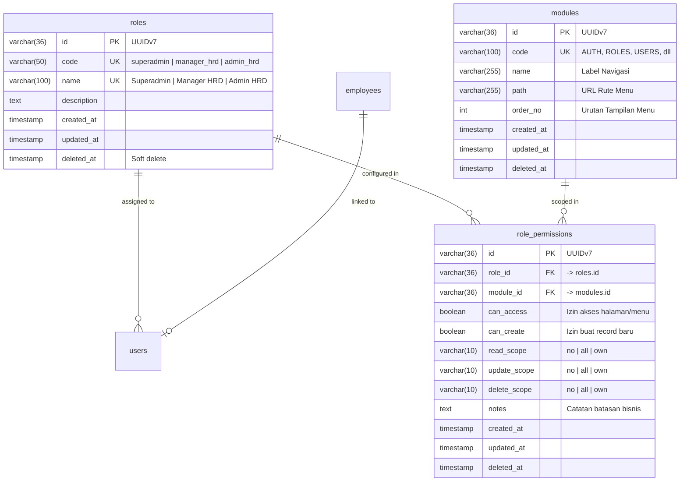

# 01. Hak Akses & Role-Based Access Control (RBAC)

Dokumen ini memuat spesifikasi kebutuhan fungsional dan teknis pengaturan **Hak Akses Sistem (RBAC)** yang terintegrasi langsung dengan rancangan basis data pada [schema-db.md](file:///c:/Users/mastr/Documents/projectfreelancer/prototipe-jmc-admin-ui-nuxt/docs/contexts/schema-db.md) dan implementasi skema `app/databases/schema.js`.

---

## 1. Matriks Hak Akses Resmi (Role Access Matrix)

Berdasarkan aturan bisnis sistem informasi administrasi, ditetapkan 3 role pengguna utama dengan wewenang terhadap 10 modul resmi:

| No | Modul / Aktivitas | Kode Modul | Path Route | Superadmin | Manager HRD | Admin HRD |
|:---:|:---|:---|:---|:---:|:---:|:---:|
| 1. | Login / Logout | `AUTH` | `/login` | **Y** | **Y** | **Y** |
| 2. | Kelola Role | `ROLES` | `/user/role` | **R** | **-** | **-** |
| 3. | Kelola User | `USERS` | `/user/manage` | **CRUD** *(kecuali hapus diri sendiri)* | **-** | **-** |
| 4. | My Profile | `MY_PROFILE` | `/profile` | **RO, UO** | **RO, UO** | **RO, UO** |
| 5. | Dashboard | `DASHBOARD` | `/` | **R** *(Metrik IT)* | **R** *(Statistik HR)* | **R** *(Operasional)* |
| 6. | Modul Data Pegawai | `EMPLOYEES` | `/pegawai` | **-** | **R** | **CRUD** *(kecuali hapus pegawai Superadmin)* |
| 7. | Modul Presensi | `ATTENDANCES` | `/attendance` | **X** | **R** | **CRUD** |
| 8. | Modul Tunjangan Transport | `TRANSPORT_ALLOWANCES` | `/tunjangan/transport` | **-** | **RO** | **RO** |
| 9. | Setting Tunjangan Transport | `TRANSPORT_SETTINGS` | `/tunjangan/setting` | **-** | **-** | **CRUD** |
| 10. | Modul Log Aktivitas | `ACTIVITY_LOGS` | `/log` | **R** | **-** | **-** |

---

## 2. Keterangan Kode Izin & Definisi Akses

| Kode | Nama Akses | Penjelasan Teknis |
|:---|:---|:---|
| **Y** | General Access | Dapat membuka dan mengakses fitur tanpa operasi CRUD data tabel. |
| **C** | Create | Diizinkan menambah data baru ke database (`can_create = true`). |
| **R** | Read All | Diizinkan membaca/melihat seluruh rekaman data (`read_scope = 'all'`). |
| **RO** | Read Own | Hanya diizinkan melihat rekaman data miliknya sendiri / pegawai terkait (`read_scope = 'own'`). |
| **U** | Update All | Diizinkan mengubah/mengedit seluruh rekaman data (`update_scope = 'all'`). |
| **UO** | Update Own | Hanya diizinkan mengubah data profil miliknya sendiri (`update_scope = 'own'`). |
| **D** | Delete All | Diizinkan menghapus data secara logis / fisik (`delete_scope = 'all'`). |
| **DO** | Delete Own | Hanya diizinkan menghapus data yang dibuat sendiri (`delete_scope = 'own'`). |
| **CRUD** | Full Access | Kombinasi izin Create (`true`), Read All (`all`), Update All (`all`), Delete All (`all`). |
| **-** / **X** | No Access | Tidak memiliki akses ke modul / rute terkait (`can_access = false`). |

---

## 3. Korelasi Skema Database (RBAC Domain)

Pengaturan wewenang disimpan secara relasional dan ternormalisasi pada basis data MySQL dengan skema berikut (mengacu pada [schema-db.md](file:///c:/Users/mastr/Documents/projectfreelancer/prototipe-jmc-admin-ui-nuxt/docs/contexts/schema-db.md)):

### Pemetaan Kolom `role_permissions` terhadap Kode Matriks:

| Kode Matriks Dokumen | `can_access` | `can_create` | `read_scope` | `update_scope` | `delete_scope` |
|:---|:---:|:---:|:---:|:---:|:---:|
| **Y** | `true` | `false` | `'no'` | `'no'` | `'no'` |
| **R** | `true` | `false` | `'all'` | `'no'` | `'no'` |
| **RO** | `true` | `false` | `'own'` | `'no'` | `'no'` |
| **RO, UO** | `true` | `false` | `'own'` | `'own'` | `'no'` |
| **CRUD** | `true` | `true` | `'all'` | `'all'` | `'all'` |
| **-** / **X** | `false` | `false` | `'no'` | `'no'` | `'no'` |

---

## 4. Aturan Bisnis & Strict Security Rules

Sesuai dokumen [security.md](file:///c:/Users/mastr/Documents/projectfreelancer/prototipe-jmc-admin-ui-nuxt/docs/contexts/security.md) dan [schema-db.md](file:///c:/Users/mastr/Documents/projectfreelancer/prototipe-jmc-admin-ui-nuxt/docs/contexts/schema-db.md):

1. **Strict UI Action**:
   - Jika pengguna tidak memiliki wewenang `can_create`, tombol "Tambah Data" disembunyikan (*hidden*).
   - Jika `update_scope == 'no'`, tombol aksi "Edit" pada tabel atau halaman detail disembunyikan (*hidden*).
   - Jika `delete_scope == 'no'`, tombol aksi "Hapus" pada tabel disembunyikan (*hidden*).
2. **Proteksi Khusus Kelola User**:
   - Superadmin dilarang keras menghapus akun dirinya sendiri (`userId != currentUser.id`).
3. **Proteksi Khusus Kelola Data Pegawai**:
   - Admin HRD tidak boleh menghapus data pegawai yang terafiliasi dengan akun ber-role Superadmin (`employee.users.role != 'superadmin'`).
4. **Proteksi Khusus Presensi**:
   - Superadmin berstatus `X` (tidak mengurusi dan tidak memiliki rekap absensi).
5. **Backend Mutating Guard**:
   - Setiap endpoint mutating (`POST`, `PUT`, `DELETE`) wajib memverifikasi permission di database dan melempar respon HTTP 403 Forbidden bila otorisasi tidak terpenuhi.
