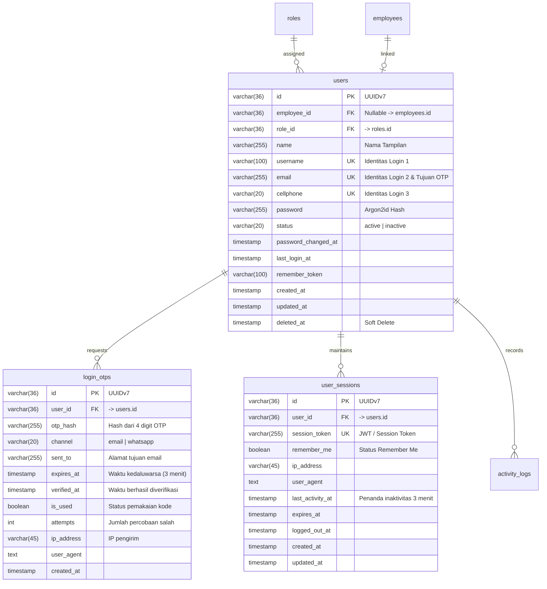
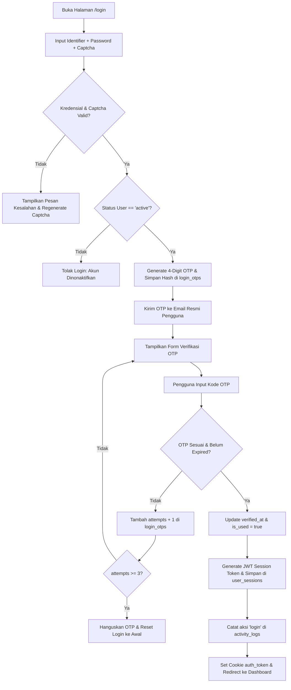

# 02. Login, Logout, dan Manajemen Sesi

Dokumen ini memuat spesifikasi kebutuhan fungsional dan teknis autentikasi pengguna, verifikasi OTP, serta manajemen sesi yang terintegrasi langsung dengan rancangan basis data pada [schema-db.md](file:///c:/Users/mastr/Documents/projectfreelancer/prototipe-jmc-admin-ui-nuxt/docs/contexts/schema-db.md) (Domain User & Auth).

---

## 1. Kebutuhan Fungsional Autentikasi

### A. Multi-Identifier Login
Sistem mendukung autentikasi fleksibel menggunakan salah satu dari 3 kredensial unik yang tersimpan pada tabel `users`:
1. **Username** (contoh: `superadmin`, `manager.hrd`, `admin.hrd`)
2. **Email** (contoh: `bramantyo.it@perusahaan.co.id`)
3. **Cellphone** (contoh: `081234567890`)

Serta kata sandi (**Password**) yang di-hash dengan standar aman **Argon2id** dan verifikasi **Captcha** anti-bot.

### B. Multi-Factor Authentication (OTP via Email)
Setelah verifikasi kredensial dan captcha sukses, sistem tidak langsung menerbitkan token sesi, melainkan mengirimkan kode verifikasi OTP ke alamat email resmi pengguna:
- **Format Digit**: 4 (empat) digit numerik (contoh: `7194`).
- **Penyimpanan**: Hash OTP disimpan di tabel `login_otps.otp_hash`.
- **Masa Berlaku (TTL)**: **3 menit** (180 detik) sejak kode di-generate (`expires_at`).
- **Maksimal Percobaan**: Maksimal 3 kali salah input (`attempts >= 3`), setelah itu kode dibatalkan (`is_used = true`) dan pengguna wajib mengulang login dari awal.

### C. Manajemen Sesi & Idle Inactivity Timeout
- **Masa Berlaku Sesi Default**: 3 menit inaktivitas.
- **Deteksi Aktivitas**: Setiap interaksi pengguna (klik mouse, ketukan keyboard, navigasi halaman) memperbarui waktu aktivitas terakhir pada tabel `user_sessions.last_activity_at`.
- **Session Warning**: Pada sisa waktu 30 detik (detik ke-150), aplikasi memunculkan modal dialog konfirmasi apakah pengguna ingin memperpanjang sesi aktif.
- **Auto Logout**: Jika tidak ada aktivitas selama 3 menit penuh dan Remember Me tidak dicentang, sesi dimatikan otomatis (`logged_out_at = NOW()`), cookie JWT dihapus, dan pengguna diarahkan ke `/login?reason=session_timeout`.

### D. Fitur "Remember Me"
- Disediakan checkbox **"Remember Me"** pada halaman formulir login.
- Jika pengguna mencentang *"Remember Me"*:
  - Kolom `user_sessions.remember_me` diset `true`.
  - Masa berlaku sesi diperpanjang menjadi jangka panjang (misal 30 hari).
  - Mekanisme auto logout inaktivitas 3 menit **dinonaktifkan**.
  - Pengguna hanya dapat logout melalui tombol Logout manual pada antarmuka aplikasi.

### E. Mekanisme Logout & Audit Trail
- **Logout Manual**: Pengguna menekan tombol "Keluar / Logout" di dropdown navbar.
- Sistem mencatat waktu keluar pada `user_sessions.logged_out_at`.
- Sistem mencatat riwayat audit pada tabel `activity_logs` dengan aksi `'logout'`.
- Token sesi pada klien (cookie `auth_token`) dimusnahkan.

---

## 2. Korelasi Skema Database (Modul 2: User Account & Authentication)

Mengacu langsung ke [schema-db.md](file:///c:/Users/mastr/Documents/projectfreelancer/prototipe-jmc-admin-ui-nuxt/docs/contexts/schema-db.md):

---

## 3. Spesifikasi Formulir Login & Validasi

| Elemen Form | Tipe Input | Aturan & Validasi |
|:---|:---:|:---|
| **Username / Email / Cellphone** | Text | Wajib diisi. Format string disanitasi dengan Zod. Dicocokkan ke `users.username`, `users.email`, atau `users.cellphone`. |
| **Password** | Password | Wajib diisi. Minimal 8 karakter, verifikasi hash Argon2id pada backend. |
| **Captcha** | Text / Widget | Wajib diisi. Validasi string captcha acak di sisi server. |
| **Remember Me** | Checkbox | Opsional. Default: `false`. Mengatur perilaku timeout sesi inaktivitas. |
| **OTP Code** | 4-Digit Numeric | Wajib diisi pada langkah kedua. Diverifikasi terhadap `login_otps.otp_hash`. |

---

## 4. Alur Proses Autentikasi (Flowchart)

---

## 5. Kriteria Penerimaan (Acceptance Criteria)

- **AC-L01**: Pengguna dapat masuk menggunakan salah satu dari username, email, atau nomor HP yang terdaftar aktif.
- **AC-L02**: Sistem menolak login jika captcha salah atau password tidak cocok dengan hash Argon2id di database.
- **AC-L03**: Kode OTP dikirimkan ke email terdaftar dengan masa aktif 3 menit. Jika salah 3 kali, OTP hangus.
- **AC-L04**: Jika opsi Remember Me tidak dicentang, sesi pengguna ter-logout otomatis saat tidak ada interaksi selama 3 menit.
- **AC-L05**: Jika Remember Me dicentang, pengguna tetap berada dalam kondisi login hingga menekan tombol Logout manual.
- **AC-L06**: Setiap peristiwa login dan logout tercatat rapi pada tabel `activity_logs`.
