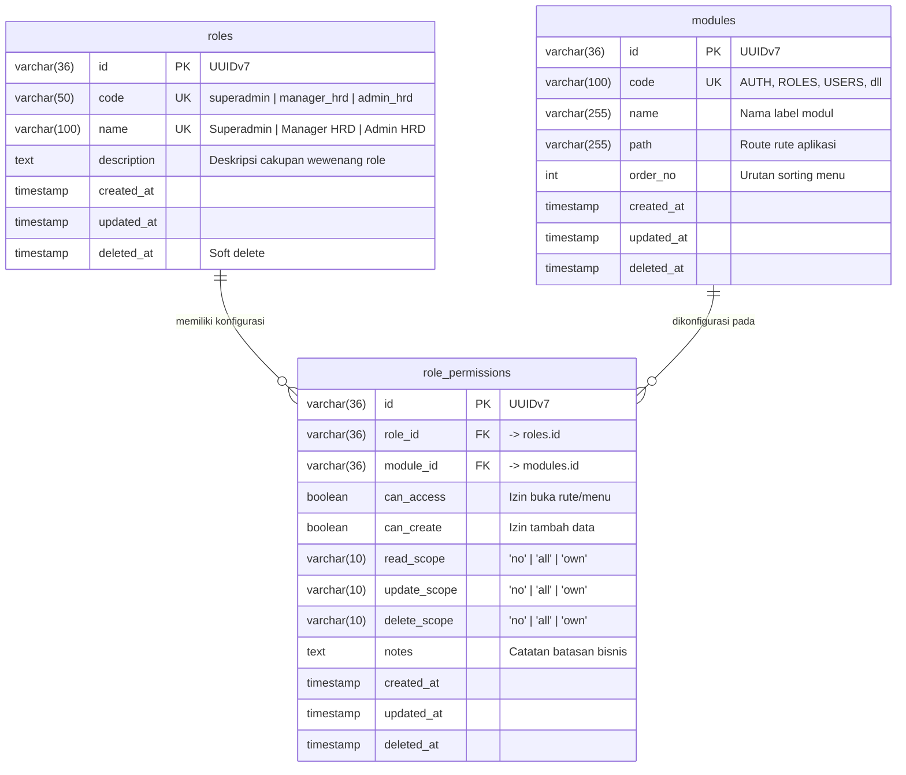

# 03. Kelola Role & Matriks Hak Akses (Role Management)

Dokumen ini memuat spesifikasi kebutuhan fungsional dan teknis antarmuka pengelolaan master role dan matriks wewenang per modul yang terhubung langsung dengan skema database [schema-db.md](file:///c:/Users/mastr/Documents/projectfreelancer/prototipe-jmc-admin-ui-nuxt/docs/contexts/schema-db.md) (Modul 1: RBAC).

---

## 1. Ringkasan Kebutuhan & Aturan Akses

1. **Pengelolaan Master Role**:
   - Sistem menyediakan halaman daftar role `/user/role` untuk melihat tingkatan peran pengguna: **Superadmin**, **Manager HRD**, dan **Admin HRD**.
   - Hak akses melihat daftar role dimiliki oleh **Superadmin** (`read_scope = 'all'`).
2. **Inspeksi & Pengeditan Matriks Hak Akses**:
   - Setiap role memiliki detail wewenang terhadap 10 modul sistem pada URL `/user/role/hak-akses/:id`.
   - Wewenang pengeditan hak akses (`canUpdate / update_scope`) hanya dimiliki secara eksklusif oleh pengguna yang memiliki wewenang update role (**Superadmin**).
3. **Penerapan Strict UI & Backend Security**:
   - Jika pengguna tidak memiliki izin update modul `ROLES`:
     - Kolom dan tombol **Aksi (Hak Akses)** pada tabel `/user/role` disembunyikan (*hidden*).
     - Tombol **Edit Hak Akses** pada halaman detail `/user/role/hak-akses/:id` disembunyikan (*hidden*), form dikunci mode baca (*readonly*).
     - Endpoint API mutating `PUT /api/roles/:id/permissions` menolak dengan respon HTTP **403 Forbidden**.

---

## 2. Korelasi Skema Database (Modul 1: RBAC)

Mengacu langsung pada [schema-db.md](file:///c:/Users/mastr/Documents/projectfreelancer/prototipe-jmc-admin-ui-nuxt/docs/contexts/schema-db.md) dan `app/databases/schema.js`:



---

## 3. Spesifikasi Halaman & Komponen Antarmuka

### A. Halaman Daftar Role (`/user/role/index.vue`)
- **Filter & Pencarian**: Filter dropdown role dan search bar untuk mencari nama atau deskripsi role.
- **Tabel Data**:
  | Kolom | Field Database | Mode Normal (Read-Only) | Mode Berwenang Edit |
  |:---|:---|:---:|:---:|
  | **No** | Auto-number | Nomor urut data | Nomor urut data |
  | **Role** | `roles.name` | Badge teks nama role | Badge nama role (clickable) |
  | **Deskripsi** | `roles.description` | Teks keterangan role | Teks keterangan role |
  | **Aksi** | - | **Hidden** (kolom & tombol hilang) | Tombol **Hak Akses** (`/user/role/hak-akses/:id`) |

### B. Halaman Detail & Edit Hak Akses (`/user/role/hak-akses/[id]/index.vue`)
- **Header Info Role**:
  - `roles.name`: Input teks (editable hanya saat mode edit aktif).
  - `roles.description`: Textarea (editable hanya saat mode edit aktif).
- **Tabel Matriks Hak Akses Per Modul**:
  | Kolom Matriks | Field `role_permissions` | Tampilan Mode Baca | Tampilan Mode Edit |
  |:---|:---|:---:|:---:|
  | **Modul / Fitur** | `modules.name` | Teks nama modul | Teks nama modul |
  | **Akses** | `can_access` | Icon centang / silang | Checkbox toggle boolean |
  | **Create** | `can_create` | Icon centang / silang | Checkbox toggle boolean |
  | **Read** | `read_scope` | Badge: `All`, `Own`, `-` | Dropdown: `all`, `own`, `no` |
  | **Update** | `update_scope` | Badge: `All`, `Own`, `-` | Dropdown: `all`, `own`, `no` |
  | **Delete** | `delete_scope` | Badge: `All`, `Own`, `-` | Dropdown: `all`, `own`, `no` |
  | **Catatan Khusus** | `notes` | Teks keterangan batasan | Input text catatan aturan |

---

## 4. Spesifikasi Integrasi API Backend

### 1. `GET /api/roles`
- **Tujuan**: Mengambil daftar role untuk tabel `/user/role`.
- **Response**: Array data `roles` (id, code, name, description, userCount).

### 2. `GET /api/roles/:id/permissions`
- **Tujuan**: Mengambil profil role dan daftar perizinan lengkap 10 modul.
- **Response**: Data detail `role` dan array `permissions` hasil query join `role_permissions` dengan `modules`.

### 3. `PUT /api/roles/:id/permissions`
- **Tujuan**: Memperbarui nama/deskripsi role serta memperbarui konfigurasi izin pada `role_permissions`.
- **Payload**:
  ```json
  {
    "name": "Superadmin",
    "description": "Pengelola sistem utama...",
    "permissions": [
      {
        "moduleId": "0191eb70-...",
        "canAccess": true,
        "canCreate": true,
        "readScope": "all",
        "updateScope": "all",
        "deleteScope": "all",
        "notes": "Dilarang menghapus akun sendiri"
      }
    ]
  }
  ```
- **Audit Trail**: Menyimpan log perubahan di tabel `activity_logs` (`action = 'update'`, `module_code = 'ROLES'`).

---

## 5. Kriteria Penerimaan (Acceptance Criteria)

- **AC-R01**: Pengguna Superadmin dapat mengakses `/user/role` dan melihat seluruh daftar role resmi.
- **AC-R02**: Pengguna tanpa hak update role tidak melihat tombol Aksi Hak Akses di tabel dan tidak melihat tombol Edit di detail.
- **AC-R03**: Pada mode edit, Superadmin dapat mengubah nama role, deskripsi, toggle akses/create, serta scoping read/update/delete.
- **AC-R04**: Tombol Simpan Perubahan memicu pembaruan ke tabel `roles` dan `role_permissions` secara transaksional, lalu dicatat ke `activity_logs`.
- **AC-R05**: Percobaan request `PUT /api/roles/:id/permissions` dari akun yang tidak memiliki wewenang update role ditolak dengan HTTP 403 Forbidden.
