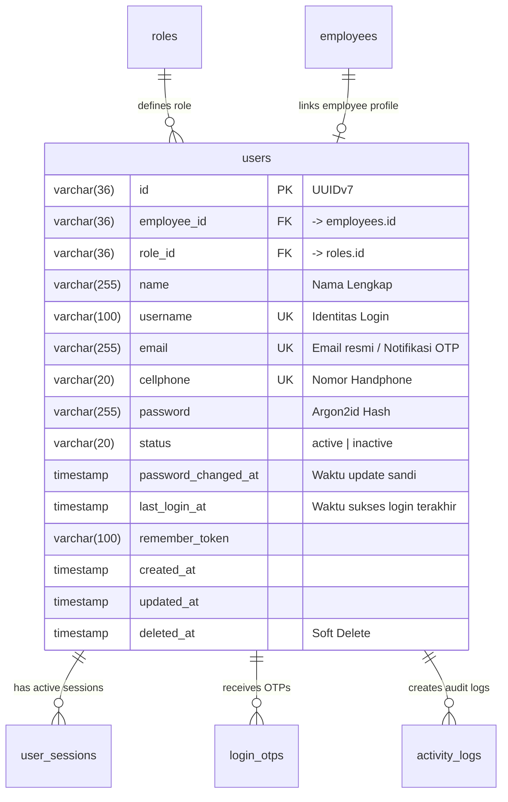

# 04. Kelola Pengguna (User Management)

Dokumen ini memuat spesifikasi kebutuhan fungsional dan teknis modul **Kelola User (User Management)** untuk melihat, menambahkan, memperbarui, menghapus, serta memberikan status aktif atau nonaktif pada user, yang terhubung langsung dengan skema basis data [schema-db.md](file:///c:/Users/mastr/Documents/projectfreelancer/prototipe-jmc-admin-ui-nuxt/docs/contexts/schema-db.md) (Modul 2: User Account & Authentication).

---

## 1. Ringkasan Kebutuhan & Konsep Utama

Modul untuk melihat, menambahkan, memperbarui, menghapus, memberikan status aktif atau nonaktif pada user.

1. **Wewenang Pengelolaan Akun**:
   - Berdasarkan Matriks Hak Akses ([01-Role-access.md](file:///c:/Users/mastr/Documents/projectfreelancer/prototipe-jmc-admin-ui-nuxt/docs/requirement/01-Role-access.md)), pengelolaan akun pengguna (`USERS`) berstatus **CRUD penuh khusus untuk Superadmin**. Role lain (**Manager HRD** dan **Admin HRD**) tidak memiliki akses ke modul ini (`-`).
2. **Koneksi Akun dengan Data Pegawai**:
   - Pembuatan akun user wajib memilih pegawai melalui fitur **autosuggestion / autocomplete** data pegawai (`employees`).
   - Tidak diperkenankan menginput nama manual di luar daftar autosuggest data pegawai.
3. **Aturan Keamanan Khusus (Strict Business Rule)**:
   - **Larangan Hapus Diri Sendiri**: Superadmin tidak diperkenankan menghapus akun pengguna miliknya sendiri yang sedang aktif digunakan (`user.id != currentUserId`). Tombol hapus disembunyikan/dinonaktifkan untuk baris akun sendiri.
   - **Enkripsi Sandi**: Password wajib di-hash menggunakan algoritma **Argon2id** berstandar enterprise sebelum disimpan ke database.
   - **Penonaktifan Akun & Otomatis Logout**: Pengguna yang statusnya aktif dapat login. Pengguna yang statusnya nonaktif tidak dapat login. **Apabila user terkait sedang dalam kondisi login dan diubah statusnya menjadi nonaktif, maka user terkait akan terlogout secara otomatis dari aplikasi** (seluruh sesi di `user_sessions` dibatalkan seketika di backend dan ditolak pada interceptor request).
   - **Soft Delete**: Penghapusan akun menggunakan mekanisme soft delete (`deleted_at IS NOT NULL`).

---

## 2. Korelasi Skema Database (Modul 2: User Account)

Mengacu pada [schema-db.md](file:///c:/Users/mastr/Documents/projectfreelancer/prototipe-jmc-admin-ui-nuxt/docs/contexts/schema-db.md) dan skema `app/databases/schema.js`:

---

## 3. Spesifikasi Tampilan & Formulir

### a. Table View User
Table view user berfungsi untuk menampilkan daftar user yang terdaftar di aplikasi. Tampilan tabel mengacu tepat pada 5 kolom standar:

| No | Nama Kolom | Tipe Data / Tampilan | Sifat / Keterangan | Field Database Terkait |
|:---|:---|:---|:---|:---|
| 1 | **No** | Number | Nomor urut baris data berhalaman | - |
| 2 | **Nama** | Text | **Sortable**. Menampilkan nama pengguna (dapat disertai badge role / jabatan di bawah nama) | `users.name` |
| 3 | **Username** | Text | **Sortable**. Username identitas login | `users.username` |
| 4 | **Status** | Icon | **Sortable**. Icon centang hijau (aktif) / icon silang merah atau abu (nonaktif) | `users.status` |
| 5 | **Aksi** | Action Buttons | Tombol aksi Edit dan Hapus | - |

> [!NOTE]
> - Filter role dan pencarian teks tetap disediakan pada toolbar di atas tabel untuk memudahkan filter data.
> - Baris akun user milik Superadmin yang sedang login tidak menampilkan tombol Hapus.

---

### b. Form Tambah & Edit User (Unified Modal Form)
Formulir terpadu yang dapat digunakan untuk mendaftarkan user baru (**Create**) maupun memperbarui data user yang sudah ada (**Edit**) dengan ketentuan:
- Pada **Mode Tambah (Create)**: Semua input wajib diisi, password digenerate otomatis melalui tombol *Generate Password*.
- Pada **Mode Ubah (Edit)**: Field data pengguna termuat dari data yang dipilih. Field **Password bersifat opsional** (hanya diisi jika admin ingin mereset/mengganti password user; jika dikosongkan maka password lama tetap digunakan).

| Metadata | Required? (Create / Edit) | Aturan / Keterangan / Tipe Form |
|:---|:---:|:---|
| **Nama Pengguna** | Ya (✔) / Ya (✔) | **Autosuggestion dan autocomplete**. • Pengguna harus memasukkan minimal dua (2) digit untuk memunculkan autosuggest. • Begitu autosuggest muncul, maka pengguna tinggal klik nama yang dimaksud. • **Tidak boleh memasukkan nama yang tidak ada dalam daftar autosuggest**. • **Data wajib diambil dari data pegawai (`employees`)**. • *Smart Auto-Fill*: Saat nama pegawai dipilih, field **Jabatan** dan **Departemen** otomatis terisi sesuai relasi pegawai tersebut (tetap dapat disesuaikan kembali bila perlu). |
| **Username** | Ya (✔) / Ya (✔) | **Input text**. • Minimal 6 karakter. • Tidak boleh ada spasi. • Hanya boleh terdiri dari huruf serta angka, untuk huruf semuanya harus kecil (lowercase). • Username bersifat **unik**, tidak boleh ada dua atau lebih username yang identik. • **Validasi aturan dilakukan secara onkeyup**. |
| **Password** | **Wajib saat Create** / **Opsional saat Edit** | • **Pada Tambah Baru**: Digenerate secara otomatis oleh aplikasi melalui tombol **"Generate Password"**. • **Pada Edit User**: Dikosongkan secara default (tidak wajib diisi kecuali ingin mereset password). • **Aturan password**:   - Minimal 8 karakter   - Tidak boleh ada spasi   - Harus ada minimal 1 huruf besar   - Harus ada minimal 1 huruf kecil   - Harus ada minimal 1 karakter khusus • **Validasi aturan dilakukan secara onkeyup** dengan indikator checklist validitas kriteria password. • Dilengkapi fitur **Show/Hide password** (ikon mata) dan tombol **"Copy to Clipboard"** agar admin mudah mendistribusikan kredensial. |
| **Jabatan** | Ya (✔) / Ya (✔) | **Dropdown dari masterdata jabatan**. • Pada dropdown terdapat kolom pencarian (searchable dropdown). • Otomatis terpilih saat nama pegawai dipilih pada autosuggest. |
| **Departemen** | Ya (✔) / Ya (✔) | **Dropdown dari masterdata departemen/unit kerja**. • Pada dropdown terdapat kolom pencarian (searchable dropdown). • Otomatis terpilih saat nama pegawai dipilih pada autosuggest. |
| **Role** | Ya (✔) / Ya (✔) | **Dropdown berupa pilihan role**. • Contoh: Admin, Manajer HRD, Staf HRD (Superadmin, Manager HRD, Admin HRD). |
| **Status** | Ya (✔) / Ya (✔) | **Checkbox dengan label "Aktif"**. • Secara default tercentang saat pembuatan user baru. • Pengguna yang statusnya aktif dapat login. • Pengguna yang statusnya nonaktif (checkbox tidak tercentang) tidak dapat login. • **Mekanisme Otomatis Logout**: Apabila user terkait sedang dalam kondisi login dan diubah statusnya menjadi nonaktif (checkbox dalam kondisi unchecked), maka sistem backend seketika membatalkan semua sesi di `user_sessions`, dan pada request berikutnya user terkait **akan terlogout secara otomatis dari aplikasi**. |

---

## 4. Spesifikasi API Backend & Standar HTTP Status Code

Semua endpoint backend **WAJIB mematuhi standar HTTP status code baku dan TIDAK BOLEH diubah/dimodifikasi** (misal: dilarang mengembalikan status `200 OK` untuk kasus error bisnis):

1. **`GET /api/users`**: Mengambil daftar pengguna dengan filter, sorting (`name`, `username`, `status`), dan paginasi.
   - `200 OK`: Data berhasil diambil.
   - `401 Unauthorized`: Token sesi tidak valid atau telah kedaluwarsa.
   - `403 Forbidden`: Pengguna bukan role Superadmin.
2. **`GET /api/employees/suggest?q=:query`**: Endpoint autosuggest data pegawai aktif (minimal 2 digit).
   - `200 OK`: Mengembalikan daftar pegawai yang cocok.
   - `429 Too Many Requests`: Melebihi limit pemanggilan request (rate limit).
3. **`POST /api/users`**: Menambah pengguna baru.
   - `201 Created`: Akun user berhasil dibuat.
   - `400 Bad Request`: Format username tidak valid (ada spasi/huruf besar) atau password tidak memenuhi syarat.
   - `409 Conflict`: Username sudah terdaftar di sistem.
   - `422 Unprocessable Entity`: Input wajib tidak lengkap (contoh: `employee_id` atau `role_id` kosong).
4. **`PUT /api/users/:id`**: Memperbarui profil atau status pengguna.
   - `200 OK`: Profil berhasil diperbarui. **Jika status diubah menjadi `inactive`, seluruh token aktif di `user_sessions` langsung dihapus/dibatalkan.**
   - `400 Bad Request`: Upaya menonaktifkan status akun sendiri yang sedang aktif digunakan.
   - `404 Not Found`: User ID tidak ditemukan.
   - `409 Conflict`: Username pengganti sudah digunakan pengguna lain.
5. **`DELETE /api/users/:id`**: Menghapus akun (soft delete).
   - `204 No Content`: Akun berhasil di-soft-delete dan seluruh sesi aktif dibatalkan.
   - `400 Bad Request`: Upaya menghapus akun sendiri yang sedang aktif login (*"Anda tidak dapat menghapus akun sendiri"*).
   - `403 Forbidden`: Tidak memiliki wewenang Superadmin.
   - `404 Not Found`: User ID tidak ditemukan.

---

## 5. Kriteria Penerimaan (Acceptance Criteria)

### A. Fungsional & Antarmuka (UI/UX)
- **AC-U01**: Hanya role Superadmin yang dapat mengakses halaman `/user/manage` dan endpoint `/api/users`. Role lain ditolak dengan pesan otorisasi (403 Forbidden).
- **AC-U02**: Table View menampilkan 5 kolom standar: **No**, **Nama** (sortable), **Username** (sortable), **Status** (sortable, berupa icon centang aktif / silang nonaktif), dan **Aksi** (Edit dan Hapus).
- **AC-U03**: Modal form mendukung operasi **Create** (tambah pengguna baru) dan **Edit** (ubah data pengguna yang sudah ada). Pada mode Edit, data pengguna terisi otomatis dan input password bersifat opsional (hanya diisi jika ingin mereset password).
- **AC-U04**: Input Nama Pengguna pada modal form menggunakan **autosuggestion/autocomplete** minimal 2 karakter, data bersumber dari master data pegawai (`employees`), dan menolak pengisian nama manual di luar daftar hasil autosuggest.
- **AC-U05**: Saat nama pegawai dipilih dari autosuggest, field **Jabatan** dan **Departemen** otomatis terisi (*auto-fill*) sesuai data pegawai tersebut dan tetap dapat disesuaikan oleh admin melalui *searchable dropdown*.
- **AC-U06**: Input Username memvalidasi secara **onkeyup** ketentuan: minimal 6 karakter, tanpa spasi, seluruh huruf kecil (*lowercase*), alfanumerik, dan memastikan keunikan username.
- **AC-U07**: Form memiliki tombol **"Generate Password"** otomatis yang mematuhi aturan minimal 8 karakter, tanpa spasi, minimal 1 huruf besar, 1 huruf kecil, dan 1 karakter khusus, dengan validasi **onkeyup**, indikator checklist, fitur **Show/Hide password**, serta tombol **Copy to Clipboard**.
- **AC-U08**: Input Jabatan dan Departemen berupa *searchable dropdown* dari master data, serta Role berupa dropdown pilihan role akun.
- **AC-U09**: Status akun berupa checkbox berlabel "Aktif" (default tercentang). Jika status pengguna diubah menjadi nonaktif saat user tersebut sedang login, seluruh sesi aktifnya seketika dibatalkan sehingga user **ter-logout otomatis dari aplikasi**.
- **AC-U10**: Aksi Hapus user menerapkan mekanisme **Soft Delete** (`deleted_at = NOW()`), tidak menghapus baris fisik secara permanen dari database, membatalkan semua sesi aktif user di `user_sessions`, dan mengecualikan akun yang telah terhapus dari query daftar pengguna.
- **AC-U11**: Baris akun milik Superadmin yang sedang aktif login tidak menampilkan tombol hapus dan sistem menolak perintah penghapusan akun diri sendiri (400 Bad Request).

### B. Keamanan & Proteksi Sistem (Security)
- **AC-SEC01 (Password Hashing)**: Password tidak boleh disimpan dalam bentuk plain text; wajib di-hash menggunakan algoritma **Argon2id** (atau Bcrypt dengan cost factor minimal 12) sebelum disimpan ke basis data.
- **AC-SEC02 (Real-time Session Revocation)**: Penonaktifan akun (`status = 'inactive'`) atau penghapusan akun (`soft delete`) wajib secara instan menghapus/membatalkan semua token aktif pada tabel `user_sessions`, sehingga request berikutnya dari user terkait ditolak seketika (401 Unauthorized).
- **AC-SEC03 (Audit Trail & Logging)**: Setiap aksi kritikal (pembuatan user, pembaruan data/status, reset password, dan penghapusan akun) wajib dicatat ke tabel `activity_logs` beserta identitas pelaku (`causer_id`), IP Address, User Agent, dan ringkasan perubahan data (*before & after snapshot*).
- **AC-SEC04 (Self-Termination Prevention)**: Sistem backend wajib memvalidasi dan menolak secara keras (HTTP 400/403) upaya Superadmin menghapus akunnya sendiri atau menonaktifkan status akunnya sendiri untuk mencegah *system lockout* (tidak ada admin aktif yang tersisa).
- **AC-SEC05 (Anti-Brute Force & Rate Limiting)**: Endpoint pemanggilan autosuggest (`/api/employees/suggest`) dan pembuatan user baru (`POST /api/users`) wajib dilindungi *rate limiting* untuk mencegah scraping data pegawai dan serangan DoS/brute force.
- **AC-SEC06 (Input Sanitization & Output Encoding)**: Semua input data (nama, username, catatan) wajib disanitasi di sisi server guna mencegah celah keamanan **SQL Injection (SQLi)** dan **Cross-Site Scripting (XSS)**.
- **AC-SEC07 (Kredensial Masking)**: Endpoint API `GET /api/users` dan log audit tidak boleh menyertakan field hash password, remember token, maupun secret sensitif lainnya ke dalam payload respons frontend.
- **AC-SEC08 (Strict HTTP Status Code Compliance)**: Seluruh respons HTTP backend **wajib menggunakan status code baku standar RFC dan tidak boleh diubah/dikustomisasi secara menyimpang** (misal: dilarang membungkus error bisnis di dalam status `200 OK`, wajib mengembalikan `400`, `401`, `403`, `404`, `409`, `422`, atau `429` sesuai konteks error).
