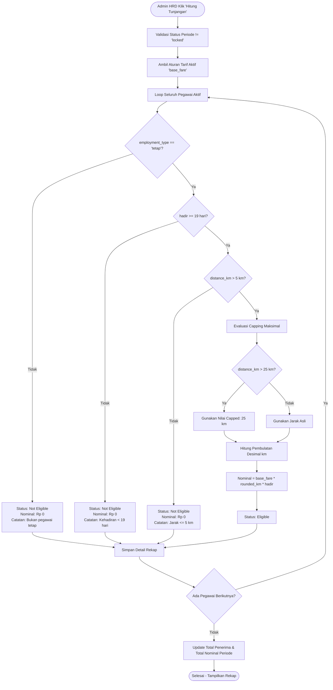

# 07. Modul Tunjangan Transport (Transport Allowance)

Dokumen ini memuat spesifikasi kebutuhan fungsional, analisis teknis, formula dan aturan perhitungan bisnis, pemetaan antarmuka (UI) Nuxt 3 / Tabler, integrasi skema database relasional, serta spesifikasi RESTful API lengkap untuk **Modul Tunjangan Transport (Poin 8 Requirement Bisnis)**.

---

## 1. Ringkasan Kebutuhan Bisnis (Requirement Point 8)

Modul Tunjangan Transport digunakan untuk menghitung tunjangan transportasi masing-masing pegawai pada bulan berjalan secara otomatis dan akurat. 

Modul ini memiliki **dua (2) halaman utama**:
1. **Halaman Daftar Bulan Berjalan** (`/tunjangan/transport`)
2. **Halaman Detail Tunjangan Transport** (`/tunjangan/transport/detail/[id]`)
*(Serta modul pendukung pengelolaan tarif dasar pada `/tunjangan/setting`)*

### Matriks Wewenang & Hak Akses (RBAC)

Mengacu pada dokumen matriks hak akses [01-Role-access.md](file:///c:/Users/mastr/Documents/projectfreelancer/prototipe-jmc-admin-ui-nuxt/docs/requirement/01-Role-access.md):

| No | Modul / Sub-Fitur | Path Route Nuxt | Superadmin | Manager HRD | Admin HRD | Deskripsi Wewenang & Scope |
|:---:|:---|:---|:---:|:---:|:---:|:---|
| 1. | **Daftar Bulan Berjalan** | `/tunjangan/transport` | **-** (403) | **RO** | **RO / Full Dept** | Melihat tabel rekap periode bulanan dengan filter tahun. |
| 2. | **Detail Tunjangan & Hitung** | `/tunjangan/transport/detail/[id]` | **-** (403) | **RO** | **CRUD / Batch** | Menampilkan daftar penerima tunjangan. Admin HRD berhak menekan tombol *"Hitung Tunjangan"*. |
| 3. | **Setting Tarif Dasar (Base Fare)** | `/tunjangan/setting` | **-** (403) | **-** (403) | **CRUD** | Menentukan tarif dasar (`base_fare` per km), batas min/max km, dan tanggal efektif. |

> [!NOTE]
> - **Superadmin**: Dilarang mengakses modul tunjangan transport (`can_access = false`, HTTP `403 Forbidden`).
> - **Admin HRD**: Eksekutor kalkulasi batch tunjangan transport seluruh pegawai dan pengelola tarif dasar.
> - **Manager HRD**: Memiliki akses peninjauan dan monitoring hasil perhitungan (Read-Only).

---

## 2. Formula, Aturan Bisnis, & Algoritma Perhitungan Tunjangan

### A. Rumus Utama Perhitungan

$$\text{Tunjangan Transport} = \text{base\_fare} \times \text{km} \times \text{jumlah hari masuk kerja}$$

Keterangan Variabel:
1. `base_fare`: Tarif tunjangan transport per kilometer yang diambil dari pengaturan aktif (`transport_allowance_settings.base_fare`).
2. `km`: Jarak tempuh rumah ke kantor pegawai (`employees.distance_km`) setelah melewati aturan validasi batas jarak dan aturan pembulatan desimal.
3. `jumlah hari masuk kerja`: Jumlah hari hadir aktual pegawai pada bulan bersangkutan (`attendance_summaries.hadir`).

---

### B. Aturan-Aturan Bisnis (Business Rules)

Berdasarkan spesifikasi resmi, proses penentuan hak tunjangan wajib mematuhi ketentuan berikut:

1. **Status Pegawai Tetap**:
   - Tunjangan transport **hanya diberikan kepada pegawai tetap** (`employees.employment_type = 'tetap'`).
   - Pegawai dengan status lain (`kontrak`, `magang`, `pns`, `pppk`) **tidak berhak** mendapatkan tunjangan transport (`eligibility_status = 'not_eligible'`, nominal = Rp 0).

2. **Ambang Batas Kehadiran Fisik (Minimal 19 Hari Kerja)**:
   - Minimal hari masuk kerja agar berhak mendapatkan tunjangan adalah **19 hari kerja**.
   - **Ketentuan Khusus**: Jika pegawai hanya masuk kerja **16 hari kerja** (atau $< 19$ hari) di bulan berjalan, maka pegawai tersebut **tidak mendapat tunjangan transport sama sekali (nominal = Rp 0), tanpa mempertimbangkan faktor lain** (`calculation_note = 'Hari masuk kerja kurang dari batas minimal (19 hari)'`).

3. **Batasan Jarak Tempuh Rumah ke Kantor (Min & Max KM)**:
   - **Batas Minimal**: Jarak minimal yang dapat diberikan tunjangan adalah **5 km**. Jarak **5 km atau kurang ( $\le 5\text{ km}$ ) TIDAK dihitung tunjangan** (`nominal = Rp 0`, `eligibility_status = 'not_eligible'`). Tunjangan hanya diberikan jika jarak $> 5\text{ km}$.
   - **Batas Maksimal**: Jarak maksimal yang dapat diberikan tunjangan adalah **25 km**. Kelebihan jarak di atas 25 km tidak dihitung tunjangan (jarak dipotong/di-*cap* maksimal menjadi **25 km**).

4. **Aturan Khusus Pembulatan Kilometer (Rounding Rule)**:
   - Evaluasi nilai desimal jarak:
     - Jika angka desimal **di bawah 0,5** ($< 0.5$): dibulatkan **ke bawah** (*round down / floor*). Contoh: $14.4\text{ km} \rightarrow 14\text{ km}$.
     - Jika angka desimal **0,5 atau lebih** ($\ge 0.5$): dibulatkan **ke atas** (*round up / ceil*). Contoh: $14.5\text{ km} \rightarrow 15\text{ km}$; $14.8\text{ km} \rightarrow 15\text{ km}$.

---

### C. Alur Algoritma Eksekusi Tombol "Hitung Tunjangan"



---

## 3. Pemetaan & Keselarasan Tampilan Antarmuka Nuxt (Tanpa Mengubah Template Bawaan)

Struktur komponen, elemen input, dan tata letak tabel pada template Nuxt 3 bawaan **dipertahankan 100%**, dengan data binding yang sepenuhnya selaras dengan spesifikasi kebutuhan:

### A. Halaman Daftar Bulan Berjalan (`app/pages/tunjangan/transport/index.vue`)

Sesuai template bawaan:
- **Card Header**:
  - **Filter Tahun**: `<select class="form-select" style="width: 180px">` berisi pilihan: *Semua Tahun*, *2026*, *2025*, *2024*, *2023*.
  - **Pencarian Data**: `<div class="input-group">` dengan `placeholder="Cari Data ..."` dan tombol icon `IconSearch`.
- **Tabel Rekap Bulan Berjalan**:
  - Kolom 1: `No` (Nomor urut `1, 2, 3, ...`).
  - Kolom 2: `Nama Bulan` (`Januari`, `Februari`, `Maret`, dst.).
  - Kolom 3: `Total Penerima` (Format number, contoh: `121`).
  - Kolom 4: `Total Tunjangan Transport` (Format rupiah, contoh: `Rp 1.532.342.000` via `formatRupiah()`).
  - Kolom 5: `Aksi` (Tombol hyperlink/NuxtLink ke `/tunjangan/transport/detail/[id]` dengan teks `"Detail"` dan kelas `btn btn-primary btn-sm`).
- **Card Footer**:
  - Paginasi halaman Tabler bawaan.

---

### B. Halaman Detail Tunjangan Transport (`app/pages/tunjangan/transport/detail/[id]/index.vue`)

Sesuai template bawaan:
- **Judul Header**: `<h3 class="card-title">Bulan [Nama Bulan] [Tahun]</h3>` (contoh: *Bulan Januari 2026*).
- **Card Header**:
  - **Tombol Aksi**: `<button class="btn btn-primary">Hitung Tunjangan</button>` yang memicu eksekusi proses kalkulasi batch di backend.
  - **Input Pencarian**: Input pencarian nama pegawai di sisi kanan.
- **Tabel Hasil Perhitungan Tunjangan Transport**:
  - Kolom 1: `No` (Nomor urut).
  - Kolom 2: `Nama Penerima` (Sortable, nama lengkap pegawai).
  - Kolom 3: `Kilometer` (Sortable, contoh: `15`, merepresentasikan `rounded_km`).
  - Kolom 4: `Jumlah Hari` (Sortable, contoh: `25`, merepresentasikan `attendance_days`).
  - Kolom 5: `Nominal` (Sortable, contoh: `Rp 1.250.000`, terformat rupiah rapi).
- **Card Footer**:
  - Komponen paginasi daftar penerima.

---

## 4. Korelasi Skema Database (Database Integrity)

Mengacu langsung ke [schema-db.md](file:///c:/Users/mastr/Documents/projectfreelancer/prototipe-jmc-admin-ui-nuxt/docs/contexts/schema-db.md) (Modul 6):

```mermaid
erDiagram
    transport_allowance_settings ||--o{ transport_allowance_periods : "governs"
    transport_allowance_periods ||--o{ transport_allowance_details : "contains"
    employees ||--o{ transport_allowance_details : "receives"
    attendance_summaries ||--o| transport_allowance_details : "verifies attendance"

    transport_allowance_settings {
        varchar(36) id PK "UUIDv7"
        decimal(12,2) base_fare "Tarif dasar per kilometer"
        date effective_start "Tanggal mulai berlaku"
        decimal(6,2) min_km "Batas minimal km (default 5.00)"
        decimal(6,2) max_km "Batas maksimal km (default 25.00)"
        boolean is_active "Status aturan"
    }

    transport_allowance_periods {
        varchar(36) id PK "UUIDv7"
        smallint period_year "Tahun Periode (contoh: 2026)"
        tinyint period_month "Bulan Periode (1-12)"
        int total_recipients "Jumlah Karyawan Berhak (nominal > 0)"
        decimal(15,2) total_amount "Total Akumulasi Tunjangan Transport"
        varchar(20) status "'draft' | 'calculated' | 'locked'"
        varchar(36) calculated_by FK "-> users.id"
        timestamp calculated_at "Waktu kalkulasi dieksekusi"
    }

    transport_allowance_details {
        varchar(36) id PK "UUIDv7"
        varchar(36) transport_allowance_period_id FK "-> transport_allowance_periods.id"
        varchar(36) employee_id FK "-> employees.id"
        decimal(12,2) base_fare "Tarif per km yang di-snapshot"
        decimal(6,2) original_km "Jarak asli dari profile employee"
        int rounded_km "Jarak hasil pembulatan/capping aturan (5-25 km)"
        int attendance_days "Jumlah hari hadir fisik aktual"
        decimal(15,2) nominal "Hasil perkalian formula"
        varchar(20) eligibility_status "'eligible' | 'not_eligible'"
        text calculation_note "Alasan tidak berhak atau rincian pembulatan"
    }
```

### Jaminan Integritas & Snapshot Historis
1. **Aturan Unik**: `UNIQUE(period_year, period_month)` pada tabel periode dan `UNIQUE(transport_allowance_period_id, employee_id)` pada tabel rincian menjamin tidak ada duplikasi data penerima dalam 1 bulan.
2. **Snapshot Permanen**: Nilai `base_fare`, `original_km`, `rounded_km`, dan `attendance_days` disimpan permanen di tabel detail. Jika di bulan berikutnya jarak rumah pegawai diubah atau tarif dasar berubah, arsip keuangan bulan sebelumnya tidak akan terpengaruh.

---

## 5. Standar Spesifikasi Endpoint RESTful API

Sesuai ketetapan arsitektur pada [GEMINI.md](file:///c:/Users/mastr/Documents/projectfreelancer/prototipe-jmc-admin-ui-nuxt/GEMINI.md), seluruh endpoint API wajib mematuhi standar HTTP status code dan **dilarang membungkus error di dalam status 200 OK**:

### 1. Rekap Daftar Bulan Berjalan
- `GET /api/v1/tunjangan/periods`
  - **Query Params**: `?year=2026&search=&page=1&limit=10`
  - **Deskripsi**: Mengambil daftar periode bulanan beserta agregasi penerima dan total rupiah.
  - **Response 200 OK**:
    ```json
    {
      "status": "success",
      "data": [
        {
          "id": "018e3a2b-...",
          "period_year": 2026,
          "period_month": 1,
          "bulan": "Januari",
          "total_recipients": 121,
          "total_amount": 1532342000,
          "status": "calculated"
        }
      ],
      "pagination": { "current_page": 1, "total_pages": 1, "total_items": 1 }
    }
    ```

### 2. Detail Periode & Daftar Penerima Tunjangan
- `GET /api/v1/tunjangan/periods/:id`
  - **Deskripsi**: Mengambil informasi header periode (Bulan, Tahun, Status, Total Biaya).
  - **Response Codes**: `200 OK`, `404 Not Found`.

- `GET /api/v1/tunjangan/periods/:id/details`
  - **Query Params**: `?search=&sort_by=nama&sort_dir=asc&page=1&limit=10`
  - **Deskripsi**: Mengambil daftar tabel penerima tunjangan transport untuk periode bersangkutan.
  - **Response 200 OK**:
    ```json
    {
      "status": "success",
      "data": [
        {
          "id": "018e3a3c-...",
          "employee_id": "018e11a1-...",
          "nama": "Ahmad Hermawan",
          "employment_type": "tetap",
          "original_km": 15.2,
          "km": 15,
          "hari": 22,
          "base_fare": 5000,
          "nominal": 1650000,
          "eligibility_status": "eligible",
          "calculation_note": "Memenuhi syarat (Jarak: 15 km, Hadir: 22 hari)"
        }
      ]
    }
    ```

### 3. Eksekusi Perhitungan Tunjangan (Hitung Tunjangan)
- `POST /api/v1/tunjangan/periods/:id/calculate`
  - **Deskripsi**: Menjalankan batch kalkulasi untuk seluruh pegawai yang berhak pada periode terkait.
  - **Authorization**: Khusus `Admin HRD` (`403 Forbidden` untuk role lain).
  - **Validasi Bisnis**:
    - Periode berstatus `'locked'` tidak dapat dihitung ulang (`400 Bad Request`).
    - Belum ada tarif transport aktif (`400 Bad Request`).
  - **Response Codes**:
    - `200 OK`: Proses kalkulasi sinkron berhasil diselesaikan.
    - `400 Bad Request`: Periode terkunci atau data absensi bulan terkait belum tersedia.
    - `403 Forbidden`: Pengguna tidak memiliki wewenang eksekusi.

---

## 6. Analisa Kuat & Saran Peningkatan (Tanpa Mengubah Template Bawaan)

Agar sistem siap pakai secara profesional untuk skala enterprise dan audit keuangan tanpa mengganggu desain visual template Nuxt yang sudah ada, berikut analisa mendalam serta rekomendasi yang dapat diterapkan:

### 1. Penanganan Status Data Mock yang Tidak Realistis pada `data/tunjangan-transport.js`
- **Temuan Analisa**:
  - Pada file mock `app/data/tunjangan-transport.js`, nominal Ahmad Hermawan tercatat `1.532.342.000` (1,5 Miliar rupiah untuk 1 orang per bulan).
  - Nilai ini merupakan *copy-paste* dari total akumulasi seluruh kantor (`totalTunjangan`), bukan nominal individu yang logis berdasarkan formula ($5.000 \times 15 \times 22 = \text{Rp } 1.650.000$).
- **Saran Solusi**:
  - Perbaiki dataset mock lokal agar nominal perorangan sesuai dengan hasil formula matematis nyata ($\text{base\_fare} \times \text{km} \times \text{hari}$), sehingga saat presentasi atau demo ke stakeholder, angka-angka tersebut logis dan meyakinkan.

### 2. Mekanisme Kunci Periode (`Locking Period`) Pasca Payroll
- **Temuan Analisa**:
  - Tombol "Hitung Tunjangan" pada halaman detail tidak boleh dapat diklik terus-menerus jika periode penggajian sudah dibayarkan (disetujui Finance / Manager HRD). Kalkulasi ulang yang tidak sengaja akan mengubah data historis slip gaji.
- **Saran Solusi**:
  - Tambahkan status `is_locked` pada data periode.
  - Jika status periode sudah `locked`, tombol "Hitung Tunjangan" otomatis diberi atribut `disabled` dengan tooltip `"Periode telah dikunci pasca penggajian"` tanpa merubah bentuk maupun susunan tombol.

### 3. Tooltip Penjelasan pada Kolom Kilometer & Keterangan Kelayakan
- **Temuan Analisa**:
  - Kolom `Kilometer` di tabel detail hanya memuat angka bulat (contoh: `15`). Pegawai atau HRD mungkin bertanya-tanya mengapa pegawai dengan jarak asli `28 km` hanya tertulis `25 km`, atau mengapa pegawai dengan jarak `14.4 km` tertulis `14 km`.
- **Saran Solusi**:
  - Manfaatkan atribut HTML bawaan `title` atau Tabler tooltip pada kolom `Kilometer` (contoh: `<span title="Jarak asli: 28 km (dibatasi batas maks 25 km)">25</span>`) dan kolom `Jumlah Hari` (contoh: `<span title="Minimal kehadiran 19 hari terpenuhi">22</span>`).
  - Solusi ini memberikan transparansi audit tinggi **tanpa menambah kolom baru** dan **tanpa merubah tata letak tabel bawaan**.

### 4. Tombol Feedback Loading (State Reaktif) saat Eksekusi Perhitungan
- **Temuan Analisa**:
  - Perhitungan ratusan hingga ribuan karyawan membutuhkan waktu pemrosesan beberapa detik. Jika tombol "Hitung Tunjangan" tidak memiliki feedback, pengguna cenderung menekan tombol berulang kali (*double submit*).
- **Saran Solusi**:
  - Tambahkan kelas reaktif bawaan Tabler `btn-loading` saat proses `isCalculating = true` sedang berjalan.

### 5. Pencatatan Audit Trail (`activity_logs`)
- **Temuan Analisa**:
  - Aksi penekanan tombol "Hitung Tunjangan" berdampak langsung terhadap pengeluaran kas perusahaan.
- **Saran Solusi**:
  - Setiap eksekusi tombol "Hitung Tunjangan" wajib otomatis mencatat log audit ke tabel `activity_logs` dengan rincian: `action = 'CALCULATE_TRANSPORT'`, `subject_id = period_id`, `description = 'Menghitung tunjangan transport periode Januari 2026 (Total Penerima: 121, Total: Rp 1.532.342.000)'`.

---

## 7. Kriteria Penerimaan (Acceptance Criteria)

- **AC-TT-01**: Halaman `/tunjangan/transport` menampilkan tabel rekap bulan berjalan lengkap dengan kolom No, Nama Bulan, Total Penerima, Total Tunjangan Transport (format Rupiah), dan Tombol Detail ke rute terkait.
- **AC-TT-02**: Dropdown Filter Tahun dapat memfilter daftar bulan berdasarkan tahun terpilih.
- **AC-TT-03**: Halaman detail `/tunjangan/transport/detail/[id]` menampilkan judul nama bulan dan tahun periode aktif, tombol "Hitung Tunjangan", input pencarian, dan tabel daftar penerima.
- **AC-TT-04**: Tabel rincian memuat kolom No, Nama Penerima, Kilometer, Jumlah Hari, dan Nominal yang terformat Rupiah serta mendukung fungsi pengurutan (sortable).
- **AC-TT-05**: Hanya pegawai tetap (`employment_type = 'tetap'`) yang berhak mendapatkan nominal tunjangan transport $> 0$.
- **AC-TT-06**: Pegawai dengan jumlah kehadiran kurang dari 19 hari (misal 16 hari) otomatis mendapatkan nominal Rp 0 tanpa melihat jarak tempuh.
- **AC-TT-07**: Pegawai dengan jarak tempuh $\le 5\text{ km}$ otomatis mendapatkan nominal Rp 0.
- **AC-TT-08**: Pegawai dengan jarak tempuh $> 25\text{ km}$ dihitung dengan batas maksimal 25 km.
- **AC-TT-09**: Jarak desimal dengan pecahan $< 0.5$ dibulatkan ke bawah (*floor*), sedangkan desimal $\ge 0.5$ dibulatkan ke atas (*ceil*).
- **AC-TT-10**: Hak akses mematuhi RBAC: Admin HRD memiliki hak penuh dan eksekusi hitung, Manager HRD hanya Read-Only, dan Superadmin diblokir (403 Forbidden).
- **AC-TT-11**: Seluruh API penanganan data dan error mematuhi standar HTTP status code sesuai aturan `GEMINI.md`.
