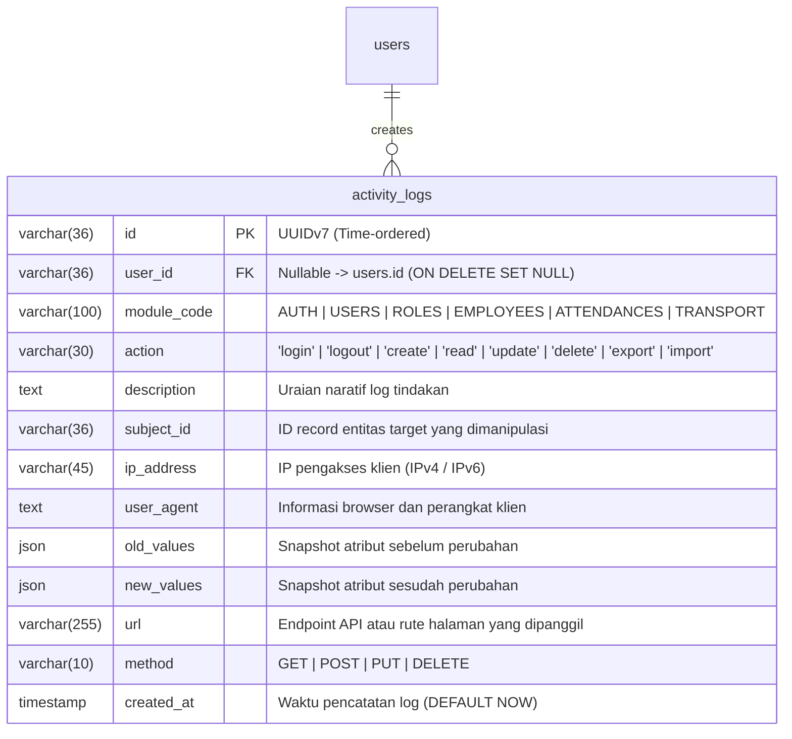
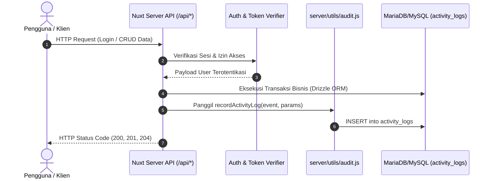

# 08. Modul Log Aktivitas & Audit Trail (Activity Logs)

Dokumen ini memuat spesifikasi lengkap, analisis bisnis & keamanan mendalam, pemetaan antarmuka (UI) Nuxt 3 / Tabler tanpa merubah struktur template bawaan, integrasi skema basis data Drizzle ORM, mekanisme pencatatan otomatis (*automatic interceptor/middleware*), spesifikasi RESTful API berstandar status code HTTP murni, serta analisis gap dan rekomendasi arsitektur terbaik untuk **Modul Log Aktivitas (Poin 9 Dokumen Requirement Bisnis)**.

---

## 1. Ringkasan Kebutuhan Bisnis (Requirement Point 9)

Berdasarkan dokumen teknis requirement:
> **Poin 9: Modul Log**, menyimpan informasi siapa login dan logout kapan, apa modul yang diakses, dan aksi apa yang dilakukan pada modul tersebut (create, read, update, delete).

### A. Inti Fungsionalitas Log:
1. **Identitas Pelaku (*Who*)**: Menyimpan informasi siapa yang melakukan aksi (`user_id`, `username`, `full_name`, dan relasi `role`).
2. **Waktu & Presisi (*When*)**: Mencatat kapan aksi dilakukan secara akurat (`created_at` timestamp dengan timezone lokal WIB).
3. **Modul yang Diakses (*Where*)**: Modul target yang diakses atau dimanipulasi (misal: `AUTH`, `USERS`, `ROLES`, `EMPLOYEES`, `ATTENDANCES`, `TRANSPORT_SETTINGS`).
4. **Jenis Tindakan (*What*)**:
   - Autentikasi: `login`, `logout`
   - Manipulasi Data: `create`, `read`, `update`, `delete`
   - Operasi Khusus: `import` (impor Excel presensi), `export` (laporan), `calculate` (hitung tunjangan).
5. **Konteks & Forensik (*Detail & Security Context*)**:
   - Menyimpan `ip_address` dan `user_agent` browser/klien.
   - Menyimpan *snapshot* data sebelum (`old_values`) dan sesudah (`new_values`) untuk aksi mutasi (`update`/`delete`) guna keperluan investigasi audit trail.

---

### B. Matriks Wewenang & Hak Akses (RBAC)

Mengacu langsung pada matriks wewenang resmi ([01-Role-access.md](file:///c:/Users/mastr/Documents/projectfreelancer/prototipe-jmc-admin-ui-nuxt/docs/requirement/01-Role-access.md)):

| No | Modul / Sub-Fitur | Path Route Nuxt | Superadmin | Manager HRD | Admin HRD | Deskripsi Hak Akses & Scope |
|:---:|:---|:---|:---:|:---:|:---:|:---|
| 1. | **Log Aktivitas & Audit Trail** | `/log` | **R (Read All)** (`read_scope = 'all'`) | **-** (403 Forbidden) | **-** (403 Forbidden) | Hak eksklusif hanya untuk Superadmin guna memantau seluruh aktivitas sistem, log keamanan, dan jejak transaksi. |

> [!IMPORTANT]
> - **Superadmin Exclusive**: Modul `/log` hanya boleh diakses oleh Superadmin. Manager HRD maupun Admin HRD dilarang mengakses halaman ini (`can_access = false`, respon HTTP `403 Forbidden`).
> - **Prinsip Immutability (Append-Only)**: Tidak ada seorang pun (termasuk Superadmin) yang diperbolehkan mengedit (`update`) atau menghapus (`delete`) data audit log. Fitur hapus data log **ditiadakan secara total** baik di level API maupun antarmuka pengguna.

---

## 2. Pemetaan Skema Basis Data Relasional (Modul 7: Log Aktivitas)

Mengacu langsung pada [schema-db.md](file:///c:/Users/mastr/Documents/projectfreelancer/prototipe-jmc-admin-ui-nuxt/docs/contexts/schema-db.md) dan definisi tabel `app/databases/schema.js`:



### Rincian Kolom & Aturan Penyimpanan:
1. **`id` (`varchar(36)`)**: Primary Key menggunakan format **UUIDv7**. Berbeda dengan UUIDv4 yang acak, UUIDv7 memiliki prefix berbasis waktu (*millisecond timestamp*), membuat *B-Tree Indexing* di MySQL/MariaDB berurutan secara natural tanpa menimbulkan fragmentasi penyimpanan disk.
2. **`user_id` (`varchar(36) NULL`)**: Menyimpan ID pengguna yang mengeksekusi aksi. Berelasi ke `users.id` dengan `ON DELETE SET NULL`. Jika user dihapus secara permanen, baris log tetap tersimpan dengan `user_id = NULL` demi menjaga integritas riwayat forensik.
3. **`module_code` (`varchar(100) NOT NULL`)**: Kode modul terstandarisasi huruf kapital (`AUTH`, `USERS`, `ROLES`, `EMPLOYEES`, `ATTENDANCES`, `TRANSPORT_SETTINGS`, `DASHBOARD`).
4. **`action` (`varchar(30) NOT NULL`)**: Jenis operasi (`login`, `logout`, `create`, `read`, `update`, `delete`, `import`, `export`).
5. **`description` (`text NULL`)**: Kalimat ringkas yang ramah pengguna, misalnya: `"Superadmin mengubah data pegawai NIP 198507152010121001"`.
6. **`subject_id` (`varchar(36) NULL`)**: ID entitas yang diproses (misal `employee_id`, `user_id`, dsb).
7. **`ip_address` (`varchar(45) NULL`)**: Mendukung alamat IPv4 maupun IPv6 yang diambil dari header jaringan `x-forwarded-for` atau socket klien.
8. **`user_agent` (`text NULL`)**: Header perangkat klien untuk pelacakan tipe peramban dan sistem operasi.
9. **`old_values` & `new_values` (`json NULL`)**: JSON object perbandingan diff nilai data sebelum dan sesudah mutasi. Password atau data kredensial sensitif **wajib di-mask/dihapus** sebelum disimpan.
10. **`created_at` (`timestamp NOT NULL`)**: Waktu pencatatan mutlak kejadian log.

---

## 3. Analisa Pemetaan Template View Bawaan Nuxt (`/app/pages/log/index.vue`)

Kode template view bawaan aplikasi di `app/pages/log/index.vue` memiliki struktur dasar Tabler UI:
```html
<template>
  <div class="card">
    <div class="card-header">
      <div class="ms-auto">
        <div class="input-group">
          <input type="text" class="form-control" placeholder="Cari Data ..." />
          <button class="btn" type="button">
            <IconSearch stroke="{2}" />
          </button>
        </div>
      </div>
    </div>
    <div class="table-responsive card-body p-0">
      <table class="table table-vcenter">
        <thead>
          <tr>
            <th width="5">No</th>
            <th>Nama User</th>
            <th>Modul</th>
            <th>Aksi</th>
            <th>Timestamp</th>
          </tr>
        </thead>
        <tbody v-for="(item, index) in logAktivitas" :key="item.id">
          ...
        </tbody>
      </table>
    </div>
    <div class="card-footer d-flex align-items-center">
      <ul class="pagination ms-auto m-0">...</ul>
    </div>
  </div>
</template>
```

### Analisa Struktur & Kepatuhan Template:
1. **Mempertahankan Template View Bawaan**:
   - Layout utama berbasis `.card` dengan elemen `.card-header` (search bar), `.table-responsive.card-body.p-0` (tabel vcenter), dan `.card-footer` (paginasi) tetap dipertahankan 100%.
   - Kolom tabel bawaan: **No**, **Nama User**, **Modul**, **Aksi**, dan **Timestamp** tetap dipertahankan sebagai pilar utama visualisasi tabel.
2. **Keterbatasan Eksisting (Gap Analysis)**:
   - Data masih mengambil data statis array dari `~/data/log-aktivitas.js` (hanya 3 baris dummy).
   - Belum terhubung secara dinamis ke endpoint API backend `/api/activity-logs`.
   - Belum ada indikator warna (*Badge Component*) pada kolom `Aksi` dan `Modul` untuk membedakan kategori aksi dengan cepat.
   - Paginasi pada template masih berupa link statis HTML hardcoded (`1, 2, 3, 4, 5, next`).
   - Pencarian `Cari Data ...` belum terikat (*two-way binding*) ke reaktif filter query API.

---

## 4. Mekanisme Rekam Log Backend (Automatic & Service-Level Auditing)

Agar seluruh aksi user tercatat tanpa membebani developer menulis kode query manual di setiap baris, sistem menggunakan pendekatan **Audit Helper Utility** terstandarisasi yang telah disiapkan di `server/utils/audit.js`.

### Alur Kerja Rekam Aktivitas:



### Matriks Pencatatan Modul & Aksi Otomatis:

| Kode Modul (`module_code`) | Jenis Aksi (`action`) | Kapan Terpicu (*Trigger Point*) | Format Deskripsi Contoh | Snapshot Diff (`old/new_values`) |
|:---|:---|:---|:---|:---:|
| `AUTH` | `login` | Saat berhasil verifikasi OTP 4-digit di `/api/auth/verify-otp` | `User 'admin_hr' berhasil login melalui verifikasi OTP.` | - |
| `AUTH` | `logout` | Saat memanggil `/api/auth/logout` | `User 'admin_hr' melakukan logout sistem.` | - |
| `USERS` | `create` | Saat menambah user baru di `/api/users` | `Membuat user akun baru: 'budi.santoso'` | `new_values` |
| `USERS` | `update` | Saat merubah data user / reset password di `/api/users/[id]` | `Memperbarui profil user 'budi.santoso'` | `old_values` & `new_values` |
| `USERS` | `delete` | Saat menghapus (soft-delete) user di `/api/users/[id]` | `Menonaktifkan user 'budi.santoso'` | `old_values` |
| `ROLES` | `update` | Saat mengubah matriks wewenang role di `/api/roles/[id]` | `Memperbarui matriks permission role 'Admin HRD'` | `old_values` & `new_values` |
| `EMPLOYEES` | `create` | Penambahan data pegawai baru | `Menambahkan pegawai baru NIP '19900101...'` | `new_values` |
| `EMPLOYEES` | `update` | Perubahan data pokok, jabatan, atau jarak rumah | `Mengubah data jarak rumah pegawai NIP '19900101...'` | `old_values` & `new_values` |
| `ATTENDANCES` | `import` | Saat upload berkas Excel presensi batch | `Mengimpor file Excel log presensi periode Mei 2026.` | - |
| `ATTENDANCES` | `update` | Koreksi manual jam presensi oleh Admin HRD | `Mengoreksi presensi tanggal 2026-05-12 NIP '19900101...'`| `old_values` & `new_values` |
| `TRANSPORT` | `update` | Perubahan tarif dasar (`base_fare`) di `/tunjangan/setting` | `Mengubah tarif dasar tunjangan transport menjadi Rp 6.000` | `old_values` & `new_values` |
| `TRANSPORT` | `create` | Menekan tombol "Hitung Tunjangan" periode tertentu | `Melakukan kalkulasi tunjangan transport periode Mei 2026.` | - |

---

## 5. Spesifikasi RESTful API (Mematuhi Standar HTTP Status Codes Penuh)

Endpoint log aktivitas diimplementasikan pada `server/api/activity-logs/index.get.js` dengan mematuhi aturan baku HTTP status codes:

### Endpoint: `GET /api/activity-logs`

#### A. Deskripsi:
Mengambil daftar riwayat log aktivitas dan audit trail dengan dukungan filter, pencarian, dan paginasi terindeks.

#### B. Header & Autentikasi:
- **Authorization**: Cookie `auth_token` atau Header `Bearer <JWT_TOKEN>`
- **Wewenang**: Khusus Role **Superadmin**

#### C. Query Parameters:
| Parameter | Tipe | Default | Keterangan |
|:---|:---:|:---:|:---|
| `page` | `number` | `1` | Nomor halaman data |
| `per_page` | `number` | `10` | Jumlah baris per halaman (10, 25, 50, 100) |
| `search` | `string` | `""` | Kata kunci pencarian (mencocokkan nama user, username, deskripsi, atau IP) |
| `module_code` | `string` | `""` | Filter modul spesifik (`AUTH`, `USERS`, `EMPLOYEES`, dll) |
| `action` | `string` | `""` | Filter jenis aksi (`login`, `logout`, `create`, `update`, `delete`, `import`) |
| `start_date` | `string` | `""` | Filter tanggal mulai (`YYYY-MM-DD`) |
| `end_date` | `string` | `""` | Filter tanggal akhir (`YYYY-MM-DD`) |

#### D. Standar Respons HTTP:

##### `200 OK` (Berhasil Memuat Log):
```json
{
  "success": true,
  "data": [
    {
      "id": "01901234-5678-7abc-def0-123456789abc",
      "userId": "01900001-2222-7abc-def0-111122223333",
      "userName": "Super Administrator",
      "username": "superadmin",
      "userRole": "Superadmin",
      "moduleCode": "USERS",
      "action": "create",
      "description": "Menambahkan akun user baru dengan username: rudi.hartono",
      "subjectId": "01902222-3333-7abc-def0-444455556666",
      "ipAddress": "192.168.1.10",
      "userAgent": "Mozilla/5.0 (Windows NT 10.0; Win64; x64) AppleWebKit/537.36...",
      "oldValues": null,
      "newValues": {
        "username": "rudi.hartono",
        "email": "rudi.hartono@company.com",
        "role": "Admin HRD"
      },
      "url": "/api/users",
      "method": "POST",
      "createdAt": "2026-05-21T10:30:00.000Z"
    },
    {
      "id": "01901234-5678-7abc-def0-987654321xyz",
      "userId": "01900001-2222-7abc-def0-111122223333",
      "userName": "Super Administrator",
      "username": "superadmin",
      "userRole": "Superadmin",
      "moduleCode": "AUTH",
      "action": "login",
      "description": "User 'superadmin' berhasil login melalui verifikasi OTP.",
      "subjectId": "01901111-2222-7abc-def0-333344445555",
      "ipAddress": "192.168.1.10",
      "userAgent": "Mozilla/5.0 (Windows NT 10.0; Win64; x64) AppleWebKit/537.36...",
      "oldValues": null,
      "newValues": null,
      "url": "/api/auth/verify-otp",
      "method": "POST",
      "createdAt": "2026-05-21T10:15:22.000Z"
    }
  ],
  "meta": {
    "currentPage": 1,
    "perPage": 10,
    "totalItems": 142,
    "totalPages": 15
  }
}
```

##### `401 Unauthorized`:
Terjadi saat token JWT tidak ada, tidak valid, atau sesi kedaluwarsa:
```json
{
  "statusCode": 401,
  "statusMessage": "Sesi tidak valid atau telah kedaluwarsa. Silakan login kembali."
}
```

##### `403 Forbidden`:
Terjadi jika pengguna bukan role Superadmin (misal: Admin HRD atau Manager HRD mencoba memanggil endpoint ini):
```json
{
  "statusCode": 403,
  "statusMessage": "Forbidden: Anda tidak memiliki wewenang untuk mengakses modul Audit Log."
}
```

---

## 6. Rekomendasi & Saran Analitis (Tanpa Mengubah Template View Bawaan)

Agar tampilan `app/pages/log/index.vue` tetap setia pada layout bawaan Nuxt Tabler, namun fungsionalitasnya maksimal, berikut rekomendasi perbaikan dan saran teknis yang dapat diterapkan:

### Saran 1: Integrasi Reaktif Paginasi & Search Bar
- **Template Bawaan**: Input pencarian berada di `.card-header` dan paginasi berada di `.card-footer`.
- **Saran**: Tambahkan `v-model="searchQuery"` dengan *debouncing* 400ms pada elemen input pencarian bawaan, dan hubungkan tombol nomor paginasi secara reaktif ke `meta.totalPages` yang dikembalikan oleh API (bukan angka 1, 2, 3 statis).

### Saran 2: Visual Badge Status Aksi & Modul
- Pada kolom `Aksi`, gunakan class badge standar Tabler UI bawaan tanpa mengubah tag `<td>`:
  - Aksi `create`: `<span class="badge bg-green-lt text-uppercase">create</span>`
  - Aksi `update`: `<span class="badge bg-yellow-lt text-uppercase">update</span>`
  - Aksi `delete`: `<span class="badge bg-red-lt text-uppercase">delete</span>`
  - Aksi `login` / `logout`: `<span class="badge bg-blue-lt text-uppercase">login</span>` / `<span class="badge bg-secondary-lt text-uppercase">logout</span>`
  - Aksi `import` / `export`: `<span class="badge bg-purple-lt text-uppercase">import</span>`
- Pada kolom `Modul`: Berikan badge abu-abu halus `<span class="badge bg-muted-lt">{{ item.modul }}</span>`.

### Saran 3: Tombol Modal Diff JSON (Nilai Lama vs Nilai Baru)
- **Saran Non-Intrusif**: Pada kolom `Aksi` atau di samping `Timestamp`, jika baris log memiliki `oldValues` atau `newValues`, sediakan tombol kecil ikon `<IconEye class="icon cursor-pointer" />` yang memunculkan modal bawaan Tabler UI (`#modal-log-diff`).
- Modal menampilkan JSON viewer sederhana yang membandingkan:
  - Kolom Kiri: **Nilai Sebelum (Old Value)**
  - Kolom Kanan: **Nilai Sesudah (New Value)**
  - Hal ini memenuhi kebutuhan audit forensik enterprise tingkat lanjut tanpa merusak estetika tabel utama.

### Saran 4: Strategi Sanitasi Kredensial (Data Sanitization)
- **Aturan Keamanan Krusial**: Pada saat mencatat payload `oldValues` atau `newValues` (misalnya pada modul `USERS` atau `AUTH`), sistem wajib melakukan *blacklisting/striping* otomatis pada key sensitif seperti `password`, `token`, `otpCode`, dan `captchaSecret` agar tidak tersimpan dalam bentuk plain text di `activity_logs`.

### Saran 5: Penjadwalan Pembersihan / Arsip Data (Log Retention Policy)
- Seiring bertambahnya transaksi, tabel `activity_logs` akan tumbuh sangat cepat.
- **Saran**: Buat penjadwalan (*cron job*) bulanan untuk mengarsipkan log yang berumur lebih dari 12 bulan ke file compressed cold-storage (JSONL terkompresi Gzip di folder arsip/S3), lalu lakukan partisi bulanan (*database table partitioning*) pada tabel `activity_logs` berbasis range `created_at`.

---

## 7. Kriteria Penerimaan (Acceptance Criteria)

- [ ] **AC-LOG-01**: Halaman `/log` hanya dapat diakses oleh user dengan Role **Superadmin**. Role lain menerima HTTP 403 Forbidden.
- [ ] **AC-LOG-02**: Setiap kali ada pengguna berhasil login atau logout, sistem otomatis membuat record log di `activity_logs` dengan `module_code = 'AUTH'`.
- [ ] **AC-LOG-03**: Setiap aksi create, update, dan delete pada modul `users`, `roles`, `employees`, `attendances`, dan `transport` otomatis terekam lengkap beserta `ip_address` dan `user_agent`.
- [ ] **AC-LOG-04**: Format waktu pada tampilan tabel menggunakan utilitas tanggal lokal Indonesia (`DD MMMM YYYY, HH:mm:ss WIB`).
- [ ] **AC-LOG-05**: Filter pencarian dapat mencari kata kunci nama user, aksi, maupun keterangan kegiatan.
- [ ] **AC-LOG-06**: Seluruh respons endpoint backend mematuhi standar HTTP Status Code (200, 401, 403, 422, 500) tanpa membungkus error di dalam status 200.
- [ ] **AC-LOG-07**: Tidak tersedia API atau tombol aksi untuk merubah atau menghapus data log aktivitas (prinsip immutability audit trail terpenuhi).
